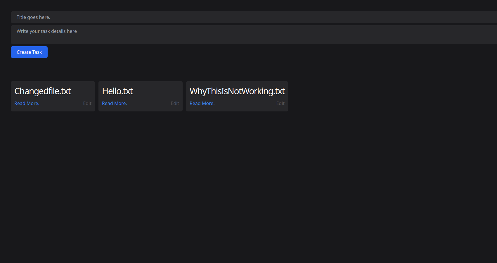
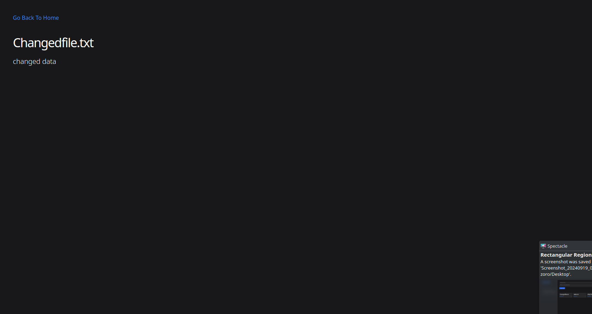
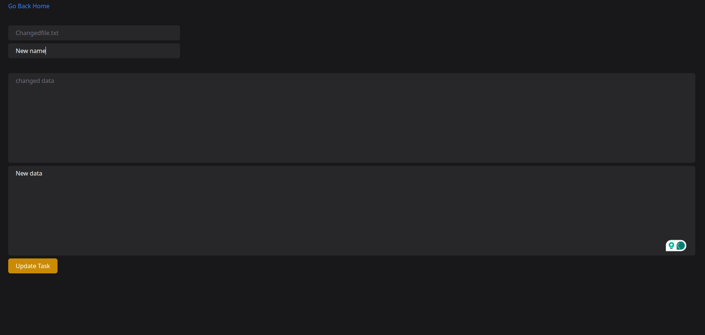

# Task Management App

A simple task management web application that allows you to create, read, and edit tasks. Each task is saved as a `.txt` file, and the app provides an interface to read the task details, update the task name, and edit the task content.

### Home Page

### Read Task

### Edit Task


## Features

- **Create Task**: Allows users to create a new task by specifying a task name and task details.
- **Read Task**: Displays the content of a task file in a readable format.
- **Edit Task**: Enables users to change both the task name and its content.
- **File-based Storage**: All tasks are stored as `.txt` files in a local folder.

## Technologies Used

- **Node.js** with Express for the server-side handling.
- **EJS** for rendering dynamic HTML templates.
- **File System (fs)** module for reading and writing tasks as `.txt` files.
- **HTML/CSS** for basic frontend layout.

## Installation

1. Clone the repository:
   ```bash
   git clone https://github.com/ShubhamNegi4/task-management-app.git
